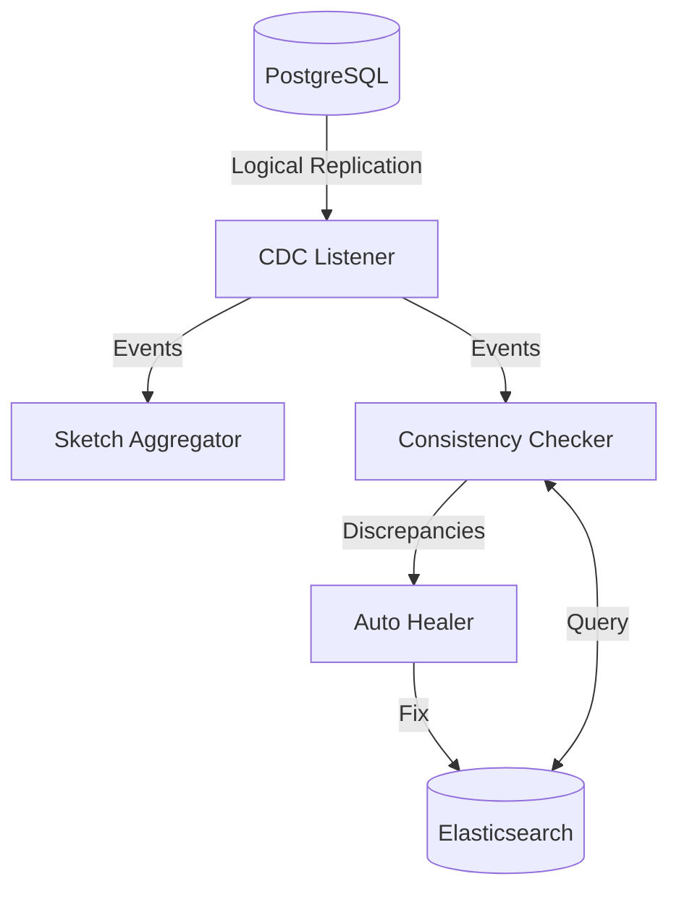

# Consistency Auditor

A production-ready Go service that monitors data consistency between PostgreSQL and Elasticsearch using Change Data Capture (CDC), automatically heals discrepancies, and provides storage optimizations through intelligent vector quantization and sketch-based aggregation.

## Features

*   **Change Data Capture (CDC):** Real-time monitoring of PostgreSQL logical replication streams.
*   **Vector Quantization:**
    *   **Scalar Quantization:** 8/16-bit encoding.
    *   **PCA Quantization:** Dimensionality reduction. [See Mathematical Background](docs/math.md)
*   **Sketch-Based Aggregation:** HyperLogLog++ and Count-Min Sketch for efficient cardinality and frequency tracking.
*   **Automatic Healing:** Configurable strategies to resolve data inconsistencies.

## Observability

The auditor exports Prometheus metrics at `:9090/metrics` to visualize the health and efficiency of the system.


*Dashboard showing real-time consistency checks, healing rates, and compression efficiency.*

### Key Metrics
*   `discrepancies_detected_total`: Counter of data mismatches found per table.
*   `healing_operations_total`: Counter of healing attempts (success/failure).
*   `vector_compression_ratio_average`: Gauge showing current vector storage savings.

## Installation

### Prerequisites

*   Go 1.21+
*   Docker & Docker Compose
*   PostgreSQL 15+
*   Elasticsearch 8.x

### Quick Start

1.  Clone the repository.
2.  Start the services:

    ```bash
    make docker-up
    ```

3.  Build and run the application locally:

    ```bash
    make build
    ./bin/auditor -config config/config.yaml
    ```

## Configuration

The application is configured via `config/config.yaml`. Key sections include:

*   **database:** Connection details for PostgreSQL.
*   **elasticsearch:** Connection details for Elasticsearch.
*   **quantizer:** Settings for vector compression (dimensions, bits, type).
*   **sketch:** Precision settings for probabilistic data structures.
*   **healer:** Strategies for resolving inconsistencies (`trust_db`, `alert_only`).

## Architecture

The system consists of several internal components:



*   **CDC Listener:** Consumes replication events from PostgreSQL.
*   **Sketch Aggregator:** Maintains probabilistic counters for stream statistics.
*   **Consistency Checker:** Compares records between DB and ES.
*   **Auto Healer:** Remediation logic for detected discrepancies.
*   **Quantizer:** Handles vector compression and decompression.

## Development

*   **Build:** `make build`
*   **Test:** `make test`
*   **Lint:** `make lint`

## License

MIT License
