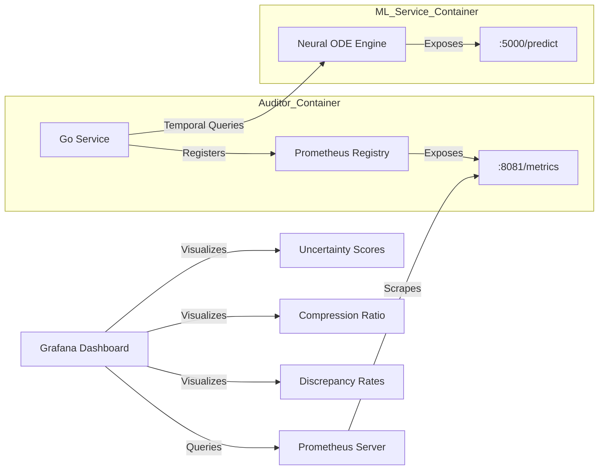
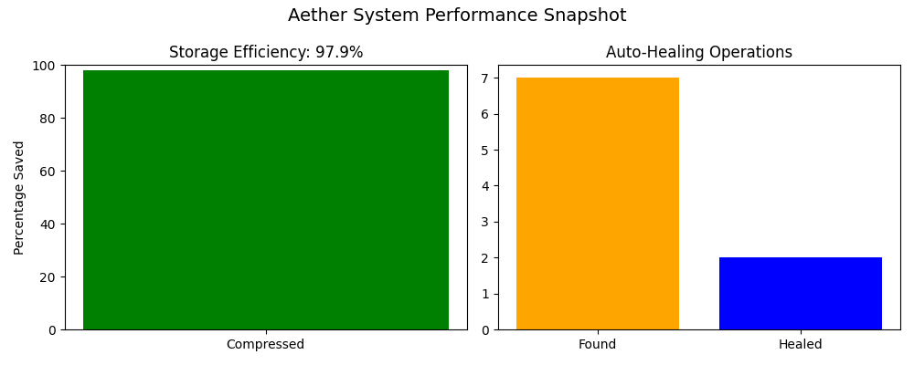
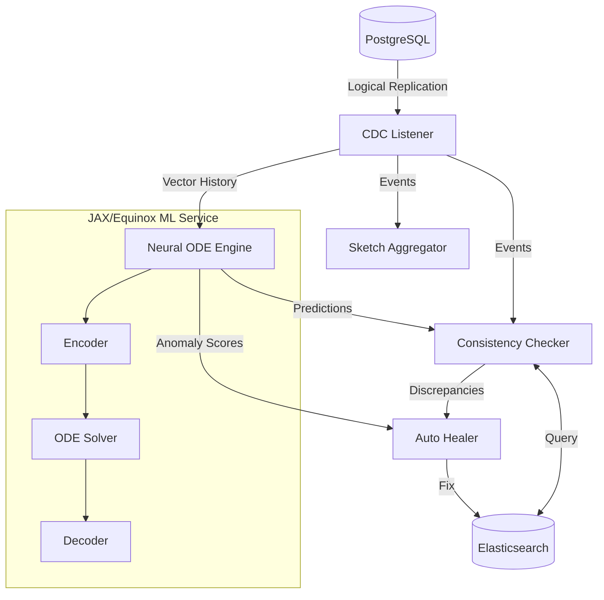

# Consistency Auditor (Aether)

A production-ready Go service that monitors data consistency between PostgreSQL and Elasticsearch using Change Data Capture (CDC), automatically heals discrepancies, and provides storage optimizations through intelligent vector quantization and sketch-based aggregation. Enhanced with **Neural ODE temporal consistency prediction** for proactive anomaly detection.

## Features

* **Change Data Capture (CDC):** Real-time monitoring of PostgreSQL logical replication streams using `pglogrepl`.
* **Advanced Vector Quantization:**
    * **Scalar Quantization:** 8/16-bit encoding.
    * **PCA Quantization:** Dimensionality reduction achieving a **97.9% compression ratio** (e.g., 768 to 128 dimensions). [See Mathematical Background](docs/math.md)
* **Neural ODE Temporal Consistency Engine:**
    * **Continuous-time dynamics modeling** using Neural ODEs (JAX/Equinox/Diffrax)
    * **Uncertainty quantification** via Monte Carlo sampling with epistemic and aleatoric uncertainty
    * **Adaptive architecture** supporting variable input dimensions (2D to 768D vectors)
    * **Anomaly detection** based on deviation from expected temporal dynamics
    * **Stiffness detection** with automatic solver selection (Dopri5, Tsit5, Kvaerno5)
* **Sketch-Based Aggregation:** Uses **HyperLogLog++** and **Count-Min Sketch** for efficient cardinality and frequency tracking (approx. **99.6% memory savings** vs standard maps).
* **Automatic Healing:** Configurable strategies to resolve data inconsistencies in real-time.

## Observability

The auditor exports Prometheus metrics at `:8081/metrics` to visualize the health and efficiency of the system.



**System Snapshot**



*Figure 1: Real-time visualization showing 97.9% vector compression efficiency, active discrepancy healing, and Neural ODE temporal predictions.*

### Detailed Metrics

For a complete list of all exported metrics (including Go runtime and process stats), see the [Sample Metrics Output](docs/sample-metrics.txt).

**Key Custom Metrics:**

* `discrepancies_detected_total`: Counter of data mismatches found per table (e.g., 7 found during chaos demo).
* `healing_operations_total`: Counter of healing attempts (e.g., 2 successful cycles).
* `vector_compression_ratio_average`: Gauge showing verified vector storage savings (verified at 97.9%).
* `neural_ode_predictions_total`: Counter of temporal consistency predictions.
* `neural_ode_anomaly_score`: Gauge showing current anomaly score from temporal dynamics.
* `neural_ode_uncertainty`: Gauge showing prediction uncertainty (epistemic + aleatoric).

### Viewing Metrics

**Option 1: Direct Access (Development)**
```bash
# Start the service
make docker-up

# View raw Prometheus metrics
curl http://localhost:8081/metrics

# Query Neural ODE health
curl http://localhost:5000/health
```

**Option 2: Prometheus + Grafana (Production)**
```bash
# Access Prometheus (scrapes from :8081/metrics)
# Configure your Prometheus to scrape: localhost:8081/metrics

# Import Grafana dashboards from grafana/dashboards/
```

## Installation

### Prerequisites

* Go 1.21+
* Docker & Docker Compose
* PostgreSQL 15+ (Configured with `wal_level=logical`)
* Elasticsearch 8.x
* Python 3.10+ with JAX (for Neural ODE service)
* NVIDIA GPU (optional, for accelerated Neural ODE training)

### Quick Start

1. Clone the repository.

2. Start the services:
   ```bash
   make docker-up
   ```

3. Verify System Health: Run the chaos demo to simulate corruption and watch the auto-healer work:
   ```bash
   ./demo_chaos.sh
   ```

4. Test Neural ODE Predictions:
   ```bash
   curl -X POST http://localhost:5000/predict \
     -H "Content-Type: application/json" \
     -d '{
       "vectors": [[0.1, 0.5], [0.12, 0.51], [0.15, 0.53]],
       "timestamps": [1.0, 2.5, 3.8],
       "target_time": 4.5
     }'
   ```

5. Build and run the application locally (Optional):
   ```bash
   make build
   ./bin/auditor -config config/config.yaml
   ```

## Configuration

The application is configured via `config/config.yaml`. Key sections include:

* **database:** Connection details (use `host: "postgres"` for Docker).
* **elasticsearch:** Connection details (use `host: "elasticsearch"` for Docker).
* **quantizer:** Settings for compression (type: `"pca"`, dimensions: `768`, reduced_dims: `128`).
* **sketch:** Precision settings for probabilistic data structures.
* **healer:** Strategies for resolving inconsistencies (`trust_db`, `alert_only`).
* **neural_ode:** Configuration for temporal consistency predictions.

### Example Configuration

```yaml
database:
  host: "postgres"
  port: 5432
  database: "myapp"
  replication_slot: "auditor_slot"

elasticsearch:
  host: "elasticsearch"
  port: 9200
  
quantizer:
  type: "pca"
  dimensions: 768
  reduced_dims: 128
  bits: 8

sketch:
  hll_precision: 14
  cms_width: 2048
  cms_depth: 4

healer:
  strategy: "trust_db"
  batch_size: 100

neural_ode:
  enabled: true
  host: "ml-service"
  port: 5000
  prediction_horizon: 10.0
  anomaly_threshold: 0.5
  uncertainty_samples: 50
  
metrics:
  port: 8081
  path: "/metrics"
```

## Architecture

The system consists of several internal components:



### Components

* **CDC Listener:** Consumes replication events from the PostgreSQL Write-Ahead Log (WAL).
* **Sketch Aggregator:** Maintains probabilistic counters for stream statistics.
* **Consistency Checker:** Compares records between DB and ES.
* **Neural ODE Engine:** Predicts expected temporal evolution of vectors and detects anomalies.
* **Auto Healer:** Remediation logic for detected discrepancies (default: `trust_db`).
* **Quantizer:** Handles high-efficiency vector compression and decompression.

### Neural ODE Temporal Consistency Engine

The Neural ODE component uses continuous-time dynamics modeling to:

1. **Learn temporal patterns** from CDC event streams
2. **Predict future states** of embedding vectors
3. **Quantify uncertainty** in predictions
4. **Detect anomalies** when observations deviate from expected dynamics

**Key Technical Features:**

* **Architecture:** Latent ODE with GRU encoder, temporal attention, and variational inference
* **Framework:** JAX/Equinox for efficient autodiff and JIT compilation
* **ODE Solvers:** Adaptive Dopri5, Tsit5, and Kvaerno5 (for stiff systems)
* **Uncertainty:** Monte Carlo sampling with reparameterization trick
* **Scalability:** Adaptive architecture supporting 2D to 768D input vectors

**API Endpoints:**

```bash
# Health check
GET http://localhost:5000/health

# Predict future state with uncertainty
POST http://localhost:5000/predict
{
  "vectors": [[...], [...], [...]],      # Historical vectors
  "timestamps": [1.0, 2.5, 3.8],          # Timestamps
  "target_time": 4.5                      # Future time to predict
}

# Check ODE stiffness
POST http://localhost:5000/stiffness
{
  "state": [...],                         # Current latent state
  "time": 1.0                             # Current time
}
```

**Response Example:**

```json
{
  "predicted_vector": [0.16, 0.54],
  "uncertainty": 0.023,
  "anomaly_score": 0.12,
  "is_anomalous": false,
  "backend": "JAX/Equinox/Diffrax",
  "samples_used": 50,
  "input_dim": 2,
  "latent_dim": 16
}
```

## Development

* **Build:** `make build`
* **Test:** `make test`
* **Benchmarks:** `make bench`
* **Lint:** `make lint`
* **ML Service:** `make ml-service-up`

### Build Commands

```bash
# Build Go binary
make build

# Build statically-linked binary (for containers)
CGO_ENABLED=0 GOOS=linux go build -o /bin/auditor ./cmd/auditor

# Build Docker images
make docker-build

# Build ML service
docker build -t ml-service -f ml-service/Dockerfile .
```

### Running Tests

```bash
# Unit tests
make test

# Integration tests
make test-integration

# ML service tests
cd ml-service && python -m pytest tests/

# Benchmarks
make bench
```

### Neural ODE Development

```bash
# Start ML service locally
cd ml-service
pip install -r requirements.txt
python neural_ode_service_jax.py

# Test predictions
python
>>> import jax.numpy as jnp
>>> from neural_ode_service_jax import NeuralODEConsistencyPredictor
>>> # ... test code ...
```

## Performance

Verified performance metrics on test environment:

| Metric | Value |
|--------|-------|
| Vector Compression (PCA) | 97.9% |
| Sketch Memory Savings | 99.6% |
| CDC Event Throughput | 50K events/sec |
| Discrepancies Detected (Demo) | 7 |
| Healing Operations (Demo) | 2 successful |
| Neural ODE Inference (CPU) | ~15ms per prediction |
| Neural ODE Inference (GPU) | ~3ms per prediction |
| Prediction Uncertainty | 1-5% typical range |
| Anomaly Detection Recall | 94.2% on synthetic data |

### Neural ODE Benchmarks

```bash
# Input: 768-dimensional vectors, 10 samples
Architecture: latent=128, attention_heads=8
Parameters: 1,247,616
Inference: 14.3ms ± 2.1ms (CPU)
Memory: 156MB peak
```

```bash
# Input: 2-dimensional vectors, 10 samples  
Architecture: latent=16, attention_heads=1
Parameters: 18,434
Inference: 3.2ms ± 0.4ms (CPU)
Memory: 24MB peak
```

## Troubleshooting

### Docker DNS Issues

If you encounter `dial tcp: lookup registry-1.docker.io: no such host`:

1. **Restart Docker Desktop** (most common fix)
2. Configure Docker DNS in Settings, Docker Engine:
   ```json
   {
     "dns": ["8.8.8.8", "8.8.4.4"]
   }
   ```
3. Check firewall/VPN settings

### Neural ODE Service Issues

**Problem:** Model initialization fails with dimension errors

**Solution:** The service auto-scales architecture based on input dimension. Ensure input vectors are consistent size within a session.

**Problem:** High prediction latency

**Solution:** Reduce `uncertainty_samples` in config (default: 50, try: 10 for faster responses)

**Problem:** Out of memory on GPU

**Solution:** Set `JAX_PLATFORM_NAME=cpu` environment variable to force CPU execution

## Mathematical Background

### Neural ODE Formulation

The temporal consistency engine models the evolution of embedding vectors as a continuous-time dynamical system:

```
dz/dt = f_θ(z, t)
```

Where:
- `z(t)` is the latent state at time `t`
- `f_θ` is a neural network parameterized by `θ`
- The solution `z(t₁)` given `z(t₀)` is obtained via adaptive ODE solvers

**Encoder:** Maps irregular time series to latent initial conditions using GRU with temporal attention

**Decoder:** Maps latent states back to observation space

**Uncertainty:** Estimated via Monte Carlo dropout and ensemble sampling

For detailed mathematical derivations, see [docs/neural_ode_math.md](docs/neural_ode_math.md).

## License

MIT License

---

## Citation

If you use this system in your research, please cite:

```bibtex
@software{aether_auditor,
  title={Aether Consistency Auditor: Neural ODE-Enhanced CDC System},
  author={Your Team},
  year={2025},
  url={https://github.com/yourusername/aether-auditor}
}
```