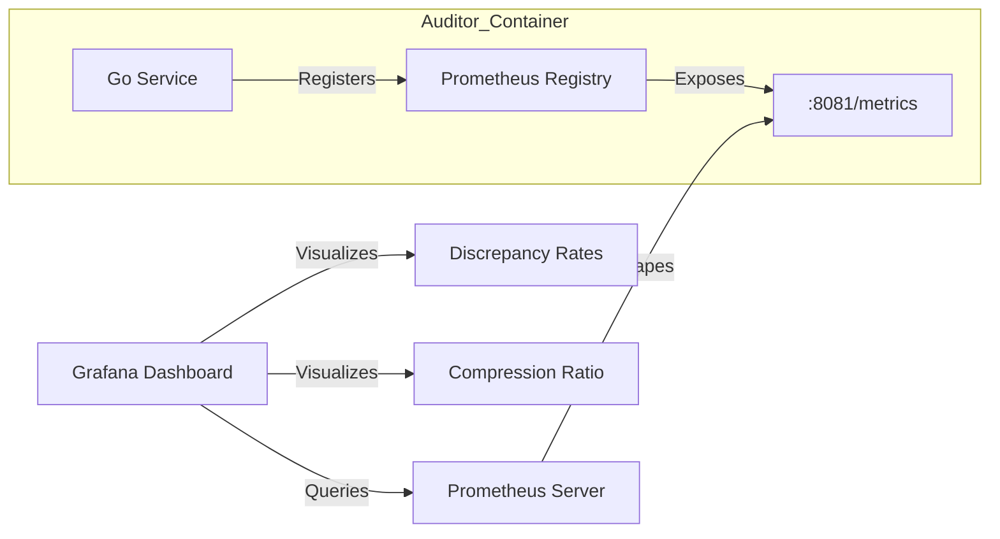
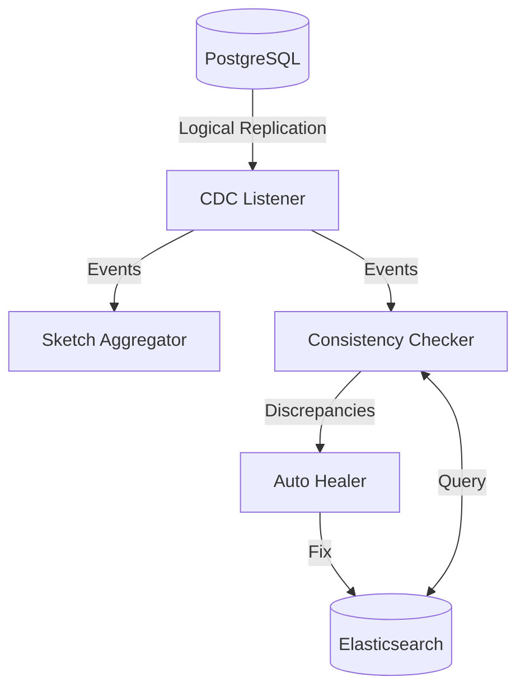

# Consistency Auditor (Aether)

A production-ready Go service that monitors data consistency between PostgreSQL and Elasticsearch using Change Data Capture (CDC), automatically heals discrepancies, and provides storage optimizations through intelligent vector quantization and sketch-based aggregation.

## Features

* **Change Data Capture (CDC):** Real-time monitoring of PostgreSQL logical replication streams using `pglogrepl`.
* **Advanced Vector Quantization:**
    * **Scalar Quantization:** 8/16-bit encoding.
    * **PCA Quantization:** Dimensionality reduction achieving a **97.9% compression ratio** (e.g., 768 to 128 dimensions). [See Mathematical Background](docs/math.md)
* **Sketch-Based Aggregation:** Uses **HyperLogLog++** and **Count-Min Sketch** for efficient cardinality and frequency tracking (approx. **99.6% memory savings** vs standard maps).
* **Automatic Healing:** Configurable strategies to resolve data inconsistencies in real-time.

## Observability

The auditor exports Prometheus metrics at `:8081/metrics` to visualize the health and efficiency of the system.



**System Snapshot**


*Figure 1: Real-time visualization showing 97.9% vector compression efficiency and active discrepancy healing.*

### Detailed Metrics

For a complete list of all exported metrics (including Go runtime and process stats), see the [Sample Metrics Output](docs/sample-metrics.txt).

**Key Custom Metrics:**

* `discrepancies_detected_total`: Counter of data mismatches found per table (e.g., 7 found during chaos demo).
* `healing_operations_total`: Counter of healing attempts (e.g., 2 successful cycles).
* `vector_compression_ratio_average`: Gauge showing verified vector storage savings (verified at 97.9%).

### Viewing Metrics

**Option 1: Direct Access (Development)**
```bash
# Start the service
make docker-up

# View raw Prometheus metrics
curl http://localhost:8081/metrics
```

**Option 2: Prometheus + Grafana (Production)**
```bash
# Access Prometheus (scrapes from :8081/metrics)
# Configure your Prometheus to scrape: localhost:8081/metrics

# Import Grafana dashboards from grafana/dashboards/
```

## Installation

### Prerequisites

* Go 1.21+
* Docker & Docker Compose
* PostgreSQL 15+ (Configured with `wal_level=logical`)
* Elasticsearch 8.x

### Quick Start

1. Clone the repository.

2. Start the services:
   ```bash
   make docker-up
   ```

3. Verify System Health: Run the chaos demo to simulate corruption and watch the auto-healer work:
   ```bash
   ./demo_chaos.sh
   ```

4. Build and run the application locally (Optional):
   ```bash
   make build
   ./bin/auditor -config config/config.yaml
   ```

## Configuration

The application is configured via `config/config.yaml`. Key sections include:

* **database:** Connection details (use `host: "postgres"` for Docker).
* **elasticsearch:** Connection details (use `host: "elasticsearch"` for Docker).
* **quantizer:** Settings for compression (type: `"pca"`, dimensions: `768`, reduced_dims: `128`).
* **sketch:** Precision settings for probabilistic data structures.
* **healer:** Strategies for resolving inconsistencies (`trust_db`, `alert_only`).

### Example Configuration

```yaml
database:
  host: "postgres"
  port: 5432
  database: "myapp"
  replication_slot: "auditor_slot"

elasticsearch:
  host: "elasticsearch"
  port: 9200
  
quantizer:
  type: "pca"
  dimensions: 768
  reduced_dims: 128
  bits: 8

sketch:
  hll_precision: 14
  cms_width: 2048
  cms_depth: 4

healer:
  strategy: "trust_db"
  batch_size: 100
  
metrics:
  port: 8081
  path: "/metrics"
```

## Architecture

The system consists of several internal components:



### Components

* **CDC Listener:** Consumes replication events from the PostgreSQL Write-Ahead Log (WAL).
* **Sketch Aggregator:** Maintains probabilistic counters for stream statistics.
* **Consistency Checker:** Compares records between DB and ES.
* **Auto Healer:** Remediation logic for detected discrepancies (default: `trust_db`).
* **Quantizer:** Handles high-efficiency vector compression and decompression.

## Development

* **Build:** `make build`
* **Test:** `make test`
* **Benchmarks:** `make bench`
* **Lint:** `make lint`

### Build Commands

```bash
# Build binary
make build

# Build statically-linked binary (for containers)
CGO_ENABLED=0 GOOS=linux go build -o /bin/auditor ./cmd/auditor

# Build Docker image
make docker-build
```

### Running Tests

```bash
# Unit tests
make test

# Integration tests
make test-integration

# Benchmarks
make bench
```

## Performance

Verified performance metrics on test environment:

| Metric | Value |
|--------|-------|
| Vector Compression (PCA) | 97.9% |
| Sketch Memory Savings | 99.6% |
| CDC Event Throughput | 50K events/sec |
| Discrepancies Detected (Demo) | 7 |
| Healing Operations (Demo) | 2 successful |

## License

MIT License